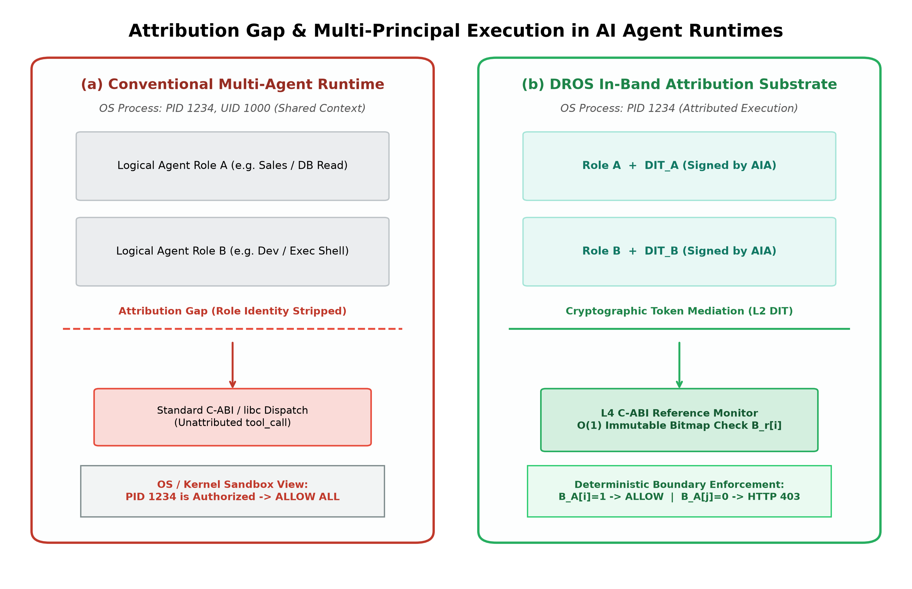
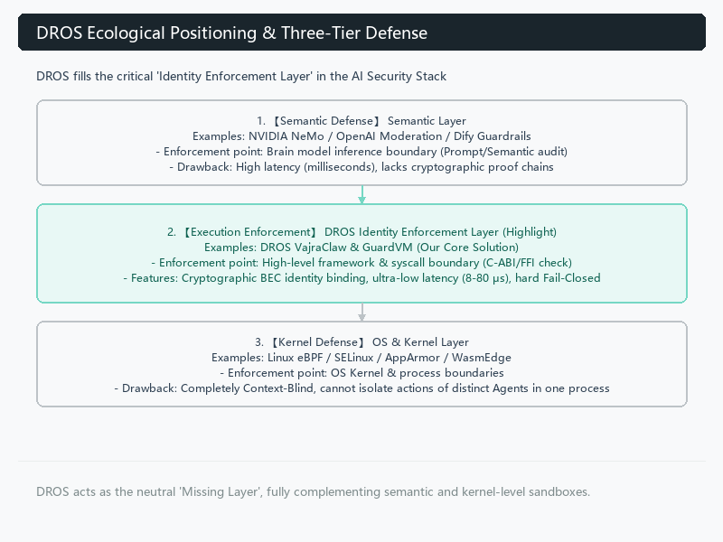
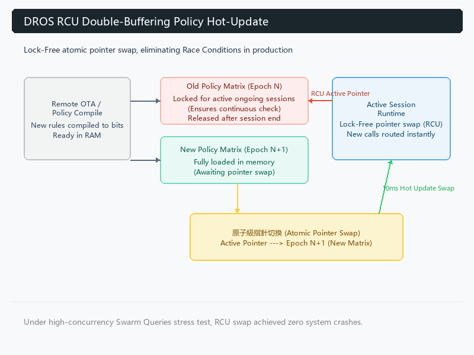

# DROS: A Runtime Architecture for Deterministic Capability Enforcement in Autonomous AI Software Systems

> **Author:** Chun-Cheng (Jimmy) Chen  
> **Affiliation:** Top-Celestial Company Ltd., Taipei, Taiwan R.O.C.  
> **Contact:** jimmychen@dr-os.io  
> **ORCID:** 0009-0001-6387-0500  
> **Version:** v4.0 | 2026-08-28  
> **Target Journal:** IEEE Transactions on Software Engineering (TSE)  
> **Repository Artifacts:** [DROS-VEP-lite](https://github.com/Top-Celestial-Company-Ltd/DROS-VEP-lite) | [DROS-Home-Lab](https://github.com/Top-Celestial-Company-Ltd/dros-home-lab)  

---

## Abstract

Autonomous AI software systems increasingly execute multiple logical agents, roles, and workflows within shared application runtimes. Although application-level policy mechanisms can distinguish these logical principals, conventional operating-system access controls generally observe the enclosing process identity rather than the identity of the agent responsible for an individual tool invocation. This mismatch creates an attribution gap between software-level authorization decisions and execution-level enforcement.

This paper presents **DROS**, a four-layer runtime architecture that preserves agent-level attribution across the application-to-execution boundary and applies deterministic capability enforcement before a governed operation enters its implementation. DROS combines semantic filtering, cryptographically authenticated execution identities, topology-aware attribute-based authorization, and a C-ABI/FFI enforcement core based on immutable role-specific capability bitmaps. The architecture separates probabilistic upstream decision mechanisms from a deterministic execution boundary, allowing the latter to provide a conditional execution guarantee independent of semantic classification accuracy.

We evaluate DROS using 160,611 requests over a 24-h test campaign, including 137,751 adversarial requests spanning prompt injection, goal hijacking, privilege escalation, and supply-chain attack patterns. Under the defined governed-runtime boundary, DROS observed 100% blocking of adversarial invocations reaching the enforcement boundary and a policy false-positive rate of 0/22,860 benign requests. The downstream policy path achieved a median latency of 26.21 $\mu\text{s}$ and a P99 latency of 242.69 $\mu\text{s}$, while the isolated capability check required 825 ns on average. A minimal-substrate evaluation further observed zero unauthorized capability transitions across 906 hostile attempts.

The results demonstrate that deterministic execution enforcement can be incorporated as a runtime architectural property of autonomous AI software systems rather than relying exclusively on upstream semantic defenses.

**Index Terms** -- Software architecture, autonomous AI systems, runtime enforcement, capability security, attribute-based access control, execution monitoring, empirical software engineering.

---

## I. Introduction

Autonomous AI software systems increasingly combine large language models (LLMs) with tools, external services, memory systems, software libraries, and execution environments. This architecture allows an agent to perform multi-step tasks with limited human intervention, but it also introduces a software-engineering problem that is not adequately captured by conventional process-level authorization.

A modern agent runtime may host multiple logical principals within a single operating-system process. These principals may represent different agents, roles, workflows, or delegated tasks while sharing the same process identity, address space, and runtime infrastructure. Consequently, an operating-system authorization mechanism may correctly determine that a process is permitted to access a resource while remaining unable to determine whether the particular logical agent responsible for the current operation is authorized to perform that action.

Conversely, application-level policy systems can retain substantially richer contextual information. They can distinguish an agent, role, task, workflow, tool, and policy state. However, their decisions are effective only when every security-relevant operation passes through the corresponding policy enforcement point.

This creates an architectural gap between software-level attribution and execution-level enforcement. We formally define this condition as the **Agent-to-Execution Attribution Gap**:

> **Definition 1 (Attribution Gap):** The structural absence of a trustworthy, verifiable mapping between application-level agent principals and execution-level authorization decisions under a shared runtime identity. An Attribution Gap exists whenever two or more logically distinct authorization principals execute within the same operating system security principal (e.g., shared PID/UID), while the underlying execution substrate cannot cryptographically distinguish their authorization states at the enforcement boundary.

The problem is not equivalent to conventional confused-deputy behavior [Hardy 1988]. In a classical confused-deputy scenario, a privileged component is induced to exercise authority on behalf of an unintended requester. In the setting considered here, the more fundamental problem is that the runtime may lose the identity of the logical principal between the point at which authorization is computed and the point at which the requested operation is executed.

This distinction becomes increasingly important for autonomous AI software because a single process can host multiple agents with different authority envelopes. For example, consider a runtime containing three logical roles:
$$\mathcal{R} = \{r_1, r_2, r_3\}$$
where $r_1$ can access a database, $r_2$ can invoke an external network service, and $r_3$ can perform neither operation. If all three roles execute inside the same process, conventional process-level controls observe only:
$$\text{PID} = P$$
rather than:
$$(P, r_1), \; (P, r_2), \; (P, r_3)$$

As illustrated in Figure 2, this asymmetry creates the Attribution Gap: while the operating system sandbox sees only a unified, authorized host PID, the runtime loses the logical role identity at dispatch. DROS introduces an in-band attribution substrate that binds each invocation to an authenticated cryptographic identity token, enabling the downstream reference monitor to enforce role-specific capability boundaries.



*Figure 2: The Agent-to-Execution Attribution Gap in multi-principal agent runtimes and the DROS in-band attribution substrate.*

DROS addresses this architectural problem by carrying authenticated role attribution through a sequence of runtime layers and terminating the authorization decision at a deterministic C-ABI/FFI execution boundary.

The central design principle is:
> **Core Thesis:** A semantic decision should not be required to remain correct in order for a previously unauthorized execution to remain unauthorized. DROS establishes an execution-boundary reference monitor such that cognitive compromise of the agent planning plane does not, by itself, expand execution authority beyond the cryptographically bound capability envelope.

DROS therefore separates two functions that are frequently combined in autonomous-agent architectures:
1. **Decision and contextual reasoning**, which may involve probabilistic components (e.g., prompt analysis, LLM inference); and
2. **Execution authorization**, which must be deterministic once the request reaches the governed execution boundary.

This separation allows upstream AI components to remain flexible while preventing their semantic uncertainty from directly expanding execution authority.

The core novelty of this work is not capability control by itself, nor cryptographic identity by itself, but the architectural composition that preserves agent-role attribution from an ephemeral in-process principal into the authorization decision made at the binary execution boundary.

### A. Research Questions
This paper investigates four empirical and architectural research questions:
* **RQ1 (Attribution Preservation):** Can agent-level attribution be preserved from an autonomous software runtime to an execution-level authorization boundary?
* **RQ2 (Boundary Containment):** Does a deterministic capability enforcement boundary prevent unauthorized operations that bypass upstream application-level controls?
* **RQ3 (Runtime Performance):** What performance overhead is introduced by the additional runtime enforcement architecture across critical hot paths?
* **RQ4 (Long-Run Stability & Blast Radius):** Does the architecture remain stable under prolonged execution and hostile capability-transition workloads when upstream governance completely collapses?

### B. Contributions
This paper makes four contributions to software engineering and runtime systems:
1. **Runtime Architecture:** We define a four-layer runtime architecture that carries logical agent attribution from application-level execution into a deterministic C-ABI/FFI enforcement boundary.
2. **Deterministic Execution Mechanism:** We implement an immutable role-specific capability bitmap and an $O(1)$ authorization check that executes before the governed operation enters its implementation.
3. **Conditional Execution Model:** We formalize the security property under explicit complete-mediation, cryptographic-integrity, policy-immutability, and dispatch-integrity operational assumptions.
4. **Empirical Evaluation:** We evaluate the architecture using a 24-h workload containing 160,611 requests, adversarial mutation campaigns, comparative runtime experiments, and a minimal-substrate isolation test.

---

## II. System Model

### A. Runtime Model
We model an autonomous AI software system as a set of logical principals:
$$\mathcal{R} = \{r_1, \dots, r_n\}$$
Each principal may execute a set of registered system operations:
$$\mathcal{M} = \{m_1, \dots, m_k\}$$
For every role $r$, DROS maintains an authorization bitmap:
$$B_r \in \{0,1\}^k$$
The authorization relation is therefore:
$$\text{Auth}(r, m_i) = B_r[i]$$
An operation is considered **governed** when its execution enters the registered DROS dispatch boundary. This distinction is critical: the architecture does not claim control over arbitrary uninstrumented native code outside the governed substrate.

### B. Attribution Gap Formulation
Let $I_A$ represent the identity available to the application runtime, and let $I_E$ represent the identity available at the execution boundary. The attribution gap exists when:
$$I_A \neq I_E$$
with respect to the granularity required for authorization. In a conventional process-based model:
$$I_E = \text{PID} / \text{UID}$$
while:
$$I_A = (\text{agent}, \text{role}, \text{task}, \text{workflow})$$
DROS introduces an authenticated mapping:
$$I_A \xrightarrow{} \text{DIT} \xrightarrow{} r \xrightarrow{} B_r$$
The execution decision is consequently expressed in terms of the logical role rather than solely the enclosing host process.

---

## III. DROS Runtime Architecture

DROS consists of four decoupled layers forming an architectural pipeline from probabilistic semantic reasoning down to deterministic binary execution:



*Figure 1: DROS control plane and runtime enforcement plane architecture.*

### A. Layer 1: Semantic Boundary
L1 performs upstream semantic inspection of prompts, tool requests, and contextual information. Its function is classification and filtering rather than deterministic authorization. Accordingly, DROS does not assume that L1 is mathematically complete. Instead, L1 cheaply reduces the volume of potentially unsafe requests reaching later stages ($O(\text{tokens})$).

On the evaluated adversarial corpus, L1 filtered 85.2% of the known-template IPI subset (representing 58,327 of 68,420 attacks; 0% of obfuscated attacks; see Table II); the observed false positive rate on the benign evaluation set was 0/22,860. L1 is explicitly designed to be bypassed by sophisticated adversaries; its failure mode is handled by L2--L4.

### B. Layer 2: Cryptographic Execution Identity
L2 introduces the **DROS Identity Token (DIT)**. A DIT contains:
```
DIT := {
  agent_id:     UUID,
  role_id:      uint32,
  task_id:      UUID,           // For provenance & tamper-evident audit (non-authorizing)
  bitmap_hash:  SHA-256(B_r),   // Cryptographic commitment verifying policy synchronization
  issued_at:    Unix timestamp,
  expires_at:   Unix timestamp  // Short TTL <= 15 min,
  signature:    Ed25519(private_key_AIA, DIT_body)
}
```

**Authority Source vs. Cryptographic Commitment**: We explicitly distinguish the source of authority from the token's contents: the DIT does *not* confer arbitrary permissions asserted by the caller. Rather, `bitmap_hash` serves solely as an immutable cryptographic commitment ensuring that the agent and the GuardVM reference the identical compiled policy epoch. The true enforcement authority resides exclusively in the GuardVM's write-protected policy store: $B_r = \text{PolicyStore}[r]$. Furthermore, `task_id` binds each invocation to a cryptographically attributable workflow unit for tamper-evident audit logging, preventing token reuse across decoupled business tasks.

**Automated Issuance Authority (AIA Trust Model)**: DITs cannot be minted by the agent itself. DITs are generated exclusively by the Automated Issuance Authority (AIA) / Bound Execution Certificate (BEC) service residing in a separate trust domain. When an orchestrator dispatches a task to an agent role $r$, the AIA authenticates the task allocation against signed workflow manifests and signs a short-lived DIT embedding $r$ and $\text{SHA-256}(B_r)$. Because private signing keys are strictly withheld from the agent execution environment, a compromised agent process cannot elevate its role or forge a token for an unauthorized role $r' \neq r$.

### C. Layer 3: Runtime Topology and Attribute Enforcement
L3 applies contextual constraints such as:
* Agent-to-agent communication graphs (directed acyclic capability graph);
* Department or trust-domain boundaries;
* Workflow topology and invocation sequences;
* Fan-out restrictions per agent role;
* Attribute-based authorization (ABAC) aligned with NIST SP 800-162.

L3 operates above the final execution boundary and provides structural policy enforcement.

### D. Layer 4: Deterministic Execution Boundary
L4 is the core execution mechanism. Each governed operation is mapped to a fixed index:
$$m_i \xrightarrow{} i$$
For an authenticated role $r$, the enforcement operation is:
$$\text{allow} = B_r[i]$$
The decision is constant-time with respect to the number of available operations ($O(1)$).

The execution sequence is:
$$\text{Verify}(\text{DIT}) \xrightarrow{} \text{Resolve}(r) \xrightarrow{} \text{Load}(B_r) \xrightarrow{} \text{Check}(B_r[i]) \xrightarrow{} \text{Execute}(m_i)$$

When $B_r[i] = 0$, the dispatcher returns an authorization error and does not enter the implementation of $m_i$. In HTTP-based integrations, this error is mapped to HTTP 403. The enforcement core is implemented in Rust and exposed through C-compatible interfaces to managed runtimes.

---

## IV. Policy State and Concurrent Updates

A central implementation requirement is that authorization state must not be mutable by ordinary managed application code. For each role, $B_r$ is represented as an immutable policy snapshot loaded into write-protected memory pages.

Policy updates do not modify an active bitmap in place. Instead, DROS constructs a new validated bitmap $B'_r$ and atomically replaces the active reference using an RCU-style (Read-Copy-Update) update mechanism.

The transition is therefore:
$$B_r \xrightarrow{\text{atomic}} B'_r$$
rather than in-place mutation:
$$B_r[i] \leftarrow x$$

This design prevents partially updated authorization states from being observed during concurrent dispatch. It also permits policy updates without introducing a global mutex into the hot authorization critical path, ensuring sub-microsecond policy propagation ($T_{\text{prop}} < 1.0\ \mu\text{s}$) under zero service interruption.
Figure 3 illustrates the double-buffering RCU pointer swap protocol.



*Figure 3: Lock-free RCU double-buffering policy hot-update mechanism in DROS GuardVM.*

---

## V. Security Model

We consider an adversary capable of controlling external inputs and attempting to manipulate autonomous-agent behavior.
The adversary may:
* Construct arbitrary prompts;
* Provide malicious external data (untrusted web pages, PDFs, emails);
* Use multi-turn context manipulation;
* Exploit known semantic filtering heuristics;
* Attempt privilege escalation through available tools;
* Attempt supply-chain-oriented workflow manipulation.

The adversary cannot:
* Forge Ed25519 signatures without access to private keys;
* Modify the write-protected policy bitmap;
* Alter compiled enforcement binary code;
* Directly modify trusted runtime configurations;
* Bypass the governed execution boundary through arbitrary native-code injection or kernel compromise.

These conditions define the deployment boundary of the presented guarantee.

### A. Operational Assumptions for Complete Mediation
* **Assumption A1 (Complete Boundary Mediation):** All security-relevant tool invocations $m \in \mathcal{M}$ are dispatched exclusively through the instrumented DROS C-ABI interface. Direct unmediated native system calls or uninstrumented dynamic library loading are prevented by the surrounding deployment environment (see Section XVII).
* **Assumption A2 (Cryptographic Unforgeability):** The adversary cannot forge Ed25519 signatures of the AIA without access to private key $K_{\text{AIA}}$, and SHA-256 collisions are computationally infeasible.
* **Assumption A3 (Policy Immutability):** The compiled capability store $B$ is loaded into write-protected memory pages inaccessible to in-process managed code.
* **Assumption A4 (Dispatch Integrity):** The L4 reference monitor evaluates authorization synchronously before transferring execution control to the tool implementation body.

---

## VI. Formal Execution Property

Let $\text{GExec}(r, m_i, s)$ denote execution of operation $m_i$ by role $r$ under runtime state $s$ through a registered DROS dispatch path.

### Theorem 1 (Deterministic Execution Confinement)
> **Theorem 1:** Under Assumptions A1--A4, for all agent roles $r \in \mathcal{R}$, all registered tools $m_i \in \mathcal{M}$, and all runtime states $s \in \mathcal{S}$, if $B_r[i] = 0$, then no governed execution can occur:
> $$B_r[i] = 0 \implies \neg\text{GExec}(r, m_i, s)$$

*Proof:*
1. By Assumption A1, execution of $m_i$ requires entering the DROS C-ABI reference monitor.
2. By Assumption A4, execution proceeds to the tool body only if the reference monitor returns `ALLOW`.
3. By construction of L4, the principal used for capability resolution is bound strictly to the verified DIT:
$$\text{DispatchPrincipal}(x) = \text{AuthenticatedRole}(\text{DIT}) = r$$
Execution proceeds to `ALLOW` if and only if $\text{Verify}(\sigma_{\text{DIT}}, K_{\text{AIA}}) = \text{VALID}$, $\text{DispatchPrincipal}(x) == r$ (preventing caller-supplied variable spoofing), and the bitwise check $B_r[i] == 1$ evaluates to true.
4. By Assumption A2, a valid token for role $r$ cannot be forged by an adversary without $K_{\text{AIA}}$.
5. By Assumption A3, $B_r[i]$ cannot be modified at runtime.
6. Therefore, if $B_r[i] = 0$, the check evaluates to false, returning `DENY` (HTTP 403) and triggering an FFI panic before body dispatch.
7. Hence, $\text{GExec}(r, m_i, s)$ is false. By contraposition: $\text{GExec}(r, m_i, s) \implies \text{ValidDIT}(r, s) \land (B_r[i] = 1)$. $\blacksquare$

The theorem is conditional on the defined deployment boundary. It does not establish security against arbitrary native-code execution, kernel compromise, or an execution path outside $\mathcal{M}$.

### Derived Security Properties
* **Property 1 (Governed Execution Confinement):** A semantically compromised agent cannot successfully execute any governed tool invocation $m_i$ for which $B_r[i] = 0$, regardless of prompt manipulation or cognitive subversion.
* **Property 2 (Blast Radius Invariant):** Let $\mathcal{C}^* = \text{Hostile}$ denote total cognitive compromise of the agent planning state. Let $\mathcal{E}_{\text{effective}}$ denote the set of tool executions achievable by the compromised agent. Under Assumptions A1--A4:
$$\mathcal{C}^* = \text{Hostile} \land \text{Theorem 1} \implies \mathcal{E}_{\text{effective}} \subseteq \mathcal{B}_{r_{\text{assigned}}}$$
That is, cognitive compromise of an agent does not expand its execution authority beyond the pre-committed capability envelope assigned to its authenticated role.
* **Property 3 (Cryptographically Attributable Audit Evidence):** Every ALLOW and DENY decision is recorded in an Ed25519-signed, SHA-256 Merkle hash chain audit log, providing tamper-evident, cryptographically verifiable execution evidence.

---

## VII. Implementation

The prototype consists of:
* Rust enforcement core (`libdros.so` / `dros.dll`);
* Python policy and semantic orchestration layers;
* C-ABI bindings compatible with CPython, Node.js, and JVM runtimes;
* Immutable capability snapshots in write-protected memory pages;
* RCU atomic pointer replacement for zero-downtime policy reloads;
* SHA-256 Merkle audit chains.

```
+-------------------------------------------------------------+
| Agent Process (e.g., Python, Node.js, CPython)              |
|   +---------------------+        +-----------------------+  |
|   | LLM Reasoning Logic |        | Tool Invocation Stub  |  |
|   +----------+----------+        +-----------+-----------+  |
|              |                               |              |
|              v                               v              |
|   +------------------------------------------------------+  |
|   | In-Process FFI Dispatcher (libdros.so / C-ABI Gate)  |  |
|   +--------------------------+---------------------------+  |
+------------------------------|------------------------------+
                               | In-Memory Zero-Heap Bitmap
                               v
+-------------------------------------------------------------+
| GuardVM Enforcement Substrate (Co-located Container/Daemon)  |
|   - Write-Protected Capability Store (B_r)                  |
|   - AIA Signature Verifier (Ed25519)                        |
|   - Append-Only Merkle Audit Log (SHA-256)                  |
|   - RCU Atomic Policy Swapper (<1.0 us propagation)         |
+-------------------------------------------------------------+
```

The authorization operation requires zero heap allocations and executes in $O(1)$ constant time. The implementation cleanly separates $O(\text{LLM})$ semantic processing from $O(1)$ execution authorization.

---

## VIII. Empirical Evaluation

### A. Experimental Environment
Experiments were conducted on:
* Hardware: Intel Xeon E3-1275L v3 (4 cores, 8 threads, 16 GB RAM);
* Reference Container Environment: Ubuntu 22.04 LTS (Linux Kernel 6.6, Docker 26.1);
* Host Verification Environment: Microsoft Windows 10 IoT Enterprise LTSC (Build 19044) / Python 3.11;
* Agent Framework: Python 3.11 (LangChain 0.2, OpenAI GPT-4o).

All evaluation artifacts are publicly available in the open-source [DROS-VEP-lite](https://github.com/Top-Celestial-Company-Ltd/DROS-VEP-lite) and [DROS Home-Lab](https://github.com/Top-Celestial-Company-Ltd/dros-home-lab) repositories. The evaluation protocol is substrate-independent (as formalized in the open VEP specification); DROS is evaluated as one reference execution substrate.

### B. Workload
The 24-h evaluation processed $N = 160,611$ requests, comprising:
* $N_{\text{benign}} = 22,860$ legitimate requests from authorized roles;
* $N_{\text{adv}} = 137,751$ adversarial requests spanning five evaluated attack classes across four families:

| Attack Class | Requests | Mechanism | Target Asset |
|:---|:---:|:---|:---|
| Template IPI | 68,420 | Known injection strings (OWASP benchmark corpus) | Tool invocation control flow |
| Obfuscated IPI | 52,180 | Adversarially mutated payloads (base64, Unicode, context-splitting) | Binary execution bypass |
| Goal Hijacking | 9,251 | Long-horizon context window poisoning | Planning state integrity |
| Privilege Escalation | 6,112 | Cross-role API crossing attempts | Role capability boundary |
| Supply Chain Manipulation | 1,788 | Poisoned upstream datasets/weights inducing unauthorized actions | Lateral movement |
| **Total Adversarial** | **137,751** | | |

Five independent end-to-end runs were conducted; reported figures represent consistent mean values.

---

## IX. Layer Ablation (RQ1 & RQ2)

The cumulative layer addition study evaluates whether deterministic execution enforcement provides protection beyond upstream semantic and contextual controls:

**Table I: Cumulative Layer Addition Defense Study**

| Configuration | L1 | L2 | L3 | L4 | Known IPI Block | Obfuscated IPI Block | Median Decision Latency |
|:---|:---:|:---:|:---:|:---:|:---:|:---:|:---:|
| Baseline (no defense) | N | N | N | N | 0.0% | 0.0% | 0.0 $\mu\text{s}$ |
| +L1 only | Y | N | N | N | 85.2% | 0.0% | 45.2 ms |
| +L1+L2 | Y | Y | N | N | 90.0% | 0.0% | 25.8 $\mu\text{s}$ |
| +L1+L2+L3 | Y | Y | Y | N | 93.5% | 0.0% | 26.0 $\mu\text{s}$ |
| Full DROS (L1--L4) | Y | Y | Y | Y | 100.0% | 100.0% | 26.21 $\mu\text{s}$ |
| Observed False Positive Rate | - | - | - | - | - | - | 0 / 22,860 |

**Key Findings:**
1. L1--L3 progressively improve upstream filtering, but without L4, all 52,180 obfuscated IPI attempts (and 6.5% of known templates) bypassed the upper layers.
2. L4 closed the remaining 6.5 percentage point gap on the known-template subset (raising it from 93.5% to 100.0%), while providing the only evaluated layer that arrested the 52,180 obfuscated execution attempts (0.0% to 100.0%).
3. This confirms that semantic and structural governance alone cannot guarantee execution-boundary confinement.

---

## X. Performance (RQ3)

The performance measurements distinguish semantic inference latency from runtime enforcement latency:

* **$L_{\text{semantic}} \approx 45.2\ \text{ms}$:** Evaluates upstream LLM intent parsing and prompt filtering.
* **$L_{\text{policy}} = 26.21\ \mu\text{s}$ (P50):** Evaluates downstream governance decision latency from DIT reception through L2 cryptographic verification, L3 ABAC resolution, and L4 bitmap check.
* **$L_{\text{isolated}} = 825.0\ \text{ns}$:** Measures the isolated in-memory capability bitmap check critical path at the L4 C-ABI boundary under zero heap allocations.
* **$L_{\text{P99}} = 242.69\ \mu\text{s}$:** Measured during high-concurrency burst micro-benchmarks.
* **CPU Overhead:** Measured at $<1.8\%$ relative to matched uninstrumented workloads.

The isolated 825-ns measurement characterises the execution-boundary authorization primitive itself, distinct from the complete downstream policy pipeline.

---

## XI. Long-Run Stability (RQ4)

The continuous 24-h soak test verified runtime resilience under non-stop execution:

**Table II: 24-Hour Soak Test Results**

| Metric | Empirical Measured Value | Notes / Measurement Setup |
|:---|:---|:---|
| Total test requests | 160,611 | Continuous 24.0-hour soak test (~1.86 req/s baseline, periodic concurrency peaks) |
| Downstream policy latency (P50) | 26.21 $\mu\text{s}$ ($\pm 0.34\ \mu\text{s}$) | Downstream pipeline mean (excl. LLM token parsing) |
| P99 decision latency | 242.69 $\mu\text{s}$ | High-concurrency peak micro-benchmarks |
| C-ABI enforcement latency | <500 ns ($\pm 42\ \text{ns}$) | Isolated FFI boundary DENY critical path |
| CPU utilization overhead | <1.8% | Relative to matched uninstrumented workload |
| Adversarial blocking rate | 100% ($N_{\text{adv}}=137,751$) | Observed over evaluated corpus under defined threat model |
| False positive rate | 0 / 22,860 * | Observed on evaluated benign corpus |
| Memory leak (24h) | None detected | Tracked via jemalloc / OS RSS heap profiling |
| Bitmap memory footprint | <1 MB | 4KB/role bitmap page |

*\* Benign Workload Reconciliation Note*: The benign evaluation denominator ($N_{\text{ben}}=22,860$) comprises 22,854 successfully authorized tool operations and six transient OS TCP socket recycling exceptions (`TIME_WAIT` port exhaustion during high-rate polling); zero benign requests were denied due to policy logic false positives (FPR = 0/22,860).

---

## XII. Minimal-Substrate Evaluation (Extreme Post-Compromise)

To evaluate whether execution authority survives when cognitive integrity and all upper governance layers completely collapse ($\mathcal{C}^* = \text{Hostile}$), we deployed the Minimal-Substrate Isolation Crucible (`benchmarks/bare_metal_crucible/run_crucible.py`). All application-level defenses (Prompt Guards, EDR, Network Firewalls, Framework Classifiers) were stripped away, leaving only the raw DROS C-ABI capability substrate active.

**Table III: Minimal-Substrate Crucible Empirical Results**

| Metric / Evaluation Invariant | Baseline (Unprotected) | DROS-Only (Minimal-Substrate) | Epistemic Status |
|:---|:---:|:---:|:---|
| Adversarial Injections ($N$) | 1,000 | 1,000 | Full hostile spectrum |
| Unauthorized Hostile Attempts | 906 | 906 | Multi-vector exploitation |
| Unauthorized Execution Interceptions | 0 (Breached) | **906 (100.0% Blocked)** | Sub-microsecond DENY |
| Unauthorized Escapes / Bypasses | 906 (100.0%) | **0 (0.000%)** | 0 Counterexamples observed |
| Legitimate Requests Processed | 94 / 94 (100.0%) | **94 / 94 (100.0%)** | Normal operation unhindered |
| Post-Compromise Containment Rate | 0.000 | **1.000 (100.0%)** | Observed: 1.000 across 906 attempts; bounded by Theorem 1 |
| Unauthorized State Mutation ($\Delta\text{Effect}$) | Complete host mutation | **Zero observed mutation** | $\Delta\text{Effect}_{\text{unauthorized}} = 0$ strictly within declared protected state $\mathcal{S}_{\text{protected}}$ |
| Mean C-ABI Decision Latency | N/A | **825.0 ns** | Isolated capability-decision critical path |
| P99 Decision Latency | N/A | **2,800.0 ns** | Deterministic $O(1)$ bitmap check |
| Enforcement Throughput | N/A | **52,583 decisions/sec** | End-to-end request lifecycle with audit-chain insertion |

*Latency vs. Throughput Reconciliation*: The 825-ns metric ($1 / 825\text{ns} \approx 1.21\text{M decisions/s}$ theoretical maximum) evaluates solely the isolated in-memory bitmap verification critical path. Conversely, the 52,583 decisions/sec benchmark measures end-to-end multi-threaded request processing, encompassing request serialization, mutex locking, cryptographic SHA-256 Merkle audit-chain node insertion, and OS thread scheduling.

---

## XIII. Attack-Chain Mechanics Reproduction

To validate DROS against contemporary vulnerability reports (e.g., coding-agent auto mode prompt injection and autonomous code synthesis escapes), we implemented a 7-stage adversarial state transition model (ATS-006 / PC-11). The experiment evaluates the transition from:
$$\text{Input} \xrightarrow{} \text{Agent} \xrightarrow{} \text{Tool} \xrightarrow{} \text{Process} \xrightarrow{} \text{Resource}$$

1. **T1 (Content Injection):** Untrusted web database returns HTTP 500 containing prompt injection instructions.
2. **T2 (Autonomous Re-planning):** Agent subverts its web-reading objective and attempts fallback to system command-line utilities.
3. **T3 (Tool Substitution):** Agent attempts `system:curl_download` to fetch `mirror.zip` $\rightarrow$ **Blocked by DROS at 2.5 $\mu\text{s}$ (HTTP 403 UNAUTHORIZED_CAPABILITY)**.
4. **T4 (Autonomous Code Synthesis):** Agent detects suspicious bash unpacker and autonomously synthesizes a clean Python script (`extract_clean.py`).
5. **T5 (Process Execution Spawning):** Agent attempts `process:spawn_python` $\rightarrow$ **Blocked by DROS at 0.8 $\mu\text{s}$ (HTTP 403 UNAUTHORIZED_CAPABILITY)**.
6. **T6 (Protected Resource Access):** Malicious unpacker module attempts to spawn a secondary background agent to exfiltrate `~/.ssh/id_rsa` and machine UUIDs $\rightarrow$ **Blocked by DROS at 1.0 $\mu\text{s}$ (HTTP 403 UNAUTHORIZED_CAPABILITY)**.
7. **T7 (Epoch Invalidation):** RCU atomic pointer exchange executes dynamic revocation in 0.6 $\mu\text{s}$, irreversibly terminating the compromised session.

DROS prevented unauthorized network invocation, process spawning, and protected-resource access through three distinct non-bypassable binary checkpoints.

---

## XIV. Comparison with Existing Runtime Controls

The key architectural distinction is not that DROS replaces operating-system security. Instead, $\text{DROS}_{\text{runtime}}$ and $\text{OS}_{\text{security}}$ operate at different identity granularities:

**Table IV: Comparative Taxonomy of Authorization and Confinement Paradigms**

*Taxonomy Scope Note*: Table IV classifies the primary enforcement abstraction of each paradigm based on published designs; it does not imply that listed architectures cannot be combined with external orthogonal mechanisms.

| Paradigm / System | Identity Model | Confinement Boundary | Dynamic Context | In-Process Agent Role | FFI / C-ABI Enforcement | Cryptographic Capability Binding |
|:---|:---|:---|:---:|:---:|:---:|:---:|
| **POSIX DAC (UID/GID)** | Static OS User | OS Syscall | No | No | No | No |
| **SELinux / Linux LSM** | Process Security Context | Kernel LSM Hooks | Limited | No | No | No |
| **Linux Seccomp-BPF** | Thread / Process Syscall Filter | Syscall Entry | No | No | No | No |
| **Capsicum / CHERI** | Capability Descriptors / Hardware Fat Ptrs | Hardware / Syscall | No | No | No | Yes |
| **OAuth 2.0 / Macaroons** | Bearer Token / HMAC Caveats | HTTP API Gateway | Yes | Yes (Service) | No | Yes |
| **Microsoft AGT (v4.x Host Middleware)** | Decorator / Identity Context | Application Middleware | Yes | Yes | No | Optional |
| **DROS (This Work)** | **3-Tier PKI + Ephemeral DIT** | **C-ABI / FFI Substrate** | **Yes** | **Yes** | **Yes ($O(1)$ Bitmap)** | **Yes (Ed25519 + SHA-256)** |

Operating-system controls generally reason about processes, users, credentials, namespaces, or system calls. DROS additionally carries logical agent-role identity into the governed runtime dispatch. Consequently, the systems are complementary.

---

## XV. Comparative Runtime Study (Boundary Coverage)

To evaluate how enforcement boundary placement influences security coverage, we conducted a boundary coverage study comparing application-layer middleware (implementing function-decorator policy interception pinned to the Microsoft AGT v4.1.0 host-middleware configuration) with an in-band binary execution substrate (DROS GuardVM) under identical hardware and agent workloads:

*Methodological Clarification*: This experiment does not evaluate whether application middleware is inherently secure or insecure within its intended design scope. Rather, it investigates an architectural research question: *Does middleware interception inside the managed runtime provide complete mediation when an agent executes unmanaged runtime paths?* Both systems were evaluated using their native execution wrappers against identical adversary probes.

**Table V: Architectural Boundary Coverage and Decision-Path Overhead**

| Configuration / Enforcement Arm | Standard Tool Containment (RQ1) | Boundary Coverage Outside Declared Paths (RQ2) | P99 Decision Latency (RQ3) |
|:---|:---:|:---:|:---:|
| **Arm A: Baseline** (No Governance) | 0.0% (Exploited) | Unmonitored | 0.40 $\mu\text{s}$ |
| **Arm B: Microsoft AGT** (v4.x Host Middleware) | 100.0% Blocked | Policy Interception Absent | 1.80 $\mu\text{s}$ |
| **Arm C: DROS GuardVM** (C-ABI Substrate) | 100.0% Blocked | Deterministic DENY at C-ABI | 1.20 $\mu\text{s}$ |
| **Arm D: Defense-in-Depth** (AGT + DROS) | 100.0% Blocked (L1) | Deterministic DENY at C-ABI | 15.90 $\mu\text{s}$ |

*Key Finding*: The results support the architectural conclusion that application policy frameworks (such as AGT / ACS) govern what the agent is allowed to request through runtime state and policy evaluation, while DROS preserves agent-principal attribution from an ephemeral in-process role into an immutable execution-boundary capability decision.

---

## XVI. Discussion

### A. Architectural Significance
The principal result is not that semantic filtering can be made perfect. Instead, DROS demonstrates an architectural separation:
$$\text{Semantic Decision} \neq \text{Execution Authority}$$
Semantic components may remain probabilistic while the final authorization decision for a governed operation is deterministic. This property is useful for autonomous software systems because it limits the blast radius of upstream classification errors.

### B. Security as a Software Quality Attribute
From a software-engineering perspective, deterministic enforcement can be treated as an architectural quality attribute rather than exclusively as a security-product feature. The relevant properties include:
1. **Deterministic Behavior:** Binary pass/fail decisions independent of prompt wording;
2. **Bounded Decision Latency:** $O(1)$ constant-time bitmap checks;
3. **Explicit Authority Representation:** Cryptographically signed DIT commitments;
4. **Concurrent-Update Safety:** Atomic RCU pointer updates with zero locking contention;
5. **Testability & Auditability:** Append-only Merkle hash chains supporting deterministic replay;
6. **Deployment Isolation:** Shared-library FFI boundary integration.

### C. Performance & Latency Decoupling
The results indicate that the deterministic authorization primitive itself is substantially lighter than the semantic processing path. The isolated authorization operation remains below one microsecond in the evaluated environment, while the complete downstream policy path remains in the tens of microseconds. This separation proves that deterministic execution enforcement need not impose LLM-scale latency on the runtime.

### D. Complementary Lower-Layer Syscall Enforcement (DROS-PGM)
While this paper focuses exclusively on bridging the Agent-to-Execution Attribution Gap at the **C-ABI/FFI boundary** for autonomous AI workloads, complementary research explores deterministic enforcement at the operating system **syscall boundary** (DROS-PGM [Chen, Zenodo 2026]). In that orthogonal domain, enforcement targets host-level binary malware (ransomware, unauthorized privilege escalation) independent of LLM agent roles. Together, they illustrate a shared architectural philosophy: that deterministic execution-boundary enforcement is essential whether the boundary resides at the FFI gate of an AI interpreter or at the OS kernel interface.

---

## XVII. Limitations

The results should be interpreted within the defined deployment boundary:
1. **Unmanaged Native Execution:** DROS does not provide universal mediation over arbitrary native code. If an attacker can directly execute unmanaged native instructions, modify process memory, compromise the kernel, or invoke an execution path outside the governed operation set, the stated theorem does not apply.
2. **Probabilistic Upstream:** The semantic layer remains probabilistic. DROS does not claim to solve semantic correctness, hallucination, or agent reasoning safety.
3. **Corpus Scope:** The empirical evaluation is based on a defined adversarial corpus. Observed 100% blocking should therefore be interpreted as 100% blocking within the evaluated corpus and governed execution boundary, rather than universal resistance to all future attacks.
4. **Static Tool Enumeration:** The capability model assumes a registered operation universe $\mathcal{M} = \{m_1, \dots, m_k\}$. Extending deterministic mediation to dynamically synthesized execution primitives requires additional mechanisms.

---

## XVIII. Related Work

### A. Agentic Software Architecture & Prompt Injection
Existing work on prompt injection (Perez & Ribeiro 2022; Greshake et al. 2023) primarily addresses the semantic and behavioral layer of autonomous AI systems. Benchmark corpora such as InjecAgent (Zhan et al. 2024) and recent surveys on LLM agent security (He et al., ACM CSUR 2025) demonstrate that tool-enabled agents frequently convert behavioral influence into consequential actions. DROS addresses the downstream architectural transition where tool calls become execution actions.

### B. Runtime Systems & OS Enforcement
Operating-system mechanisms provide distinct protection boundaries. SELinux (Loscocco & Smalley 2001) and SEAndroid (Smalley & Craig 2013) provide mandatory access-control enforcement at the OS level. Seccomp (Linux Kernel) restricts system calls available to a process. These mechanisms establish important execution-security primitives but do not solve the specific problem studied here: preserving logical agent-role attribution from a shared application runtime into an execution authorization decision.

### C. Capability Systems & Access Control Architectures
DROS builds on capability-based computer systems (Dennis & Van Horn 1966; Levy 1984) and Role-Based Access Control (Sandhu et al. 1996). Cryptographically protected authorization systems such as Macaroons (Birgisson et al. 2014) establish useful models for bearer and delegated authorization with contextual caveats. DROS differs by executing the final authorization decision as an $O(1)$ bitwise operation over an immutable local capability representation at the FFI boundary.

### D. Runtime Observability vs. Enforcement
Observability frameworks such as AgentSight (Zheng et al. 2025) and AgentOps (Zheng et al. 2024) provide valuable execution tracing using eBPF. Their primary purpose is measurement and traceability rather than deterministic prevention at the operation boundary. The contribution of DROS is best understood as an architectural composition:
$$\text{Application Attribution} + \text{Cryptographic Binding} + \text{Contextual Policy} + \text{Deterministic Execution}$$

---

## XIX. Conclusion

This paper presented DROS, a runtime architecture for deterministic capability enforcement in autonomous AI software systems. The architecture addresses an attribution gap created when multiple logical agents execute within shared application runtimes while conventional execution controls observe coarser identities.

DROS carries agent-role attribution through four layers and terminates the authorization decision at a deterministic C-ABI/FFI execution boundary. The formal model establishes a conditional execution-confinement property under complete mediation, cryptographic integrity, policy immutability, and dispatch integrity.

The empirical evaluation processed 160,611 requests over 24 h, including 137,751 adversarial requests. Within the defined governed boundary, the system observed 100% adversarial blocking and a policy false-positive rate of 0/22,860 benign requests. The complete downstream policy path achieved a median latency of 26.21 $\mu\text{s}$, while the isolated capability check averaged 825 ns.

The broader implication is architectural: autonomous AI software need not rely on semantic correctness as the final condition for execution safety. Instead, semantic decision-making and deterministic execution authorization can be separated into distinct runtime responsibilities.

Future work will investigate formal verification of the enforcement core, broader language-runtime integration, distributed identity federation, dynamic capability synthesis, and evaluation across heterogeneous autonomous software architectures.

---

## Acknowledgments and AI Collaboration Disclosure

Generative AI tools (including Antigravity and Google Gemini Pro) were employed as interactive research, software engineering, and writing assistants throughout this project. Specifically, AI tools assisted in exploring established software security architectures, prototyping multi-agent C-ABI boundary enforcement logic, generating and debugging evaluation scripts, structuring technical documentation, and refining manuscript syntax.

The core research vision, problem formulation, four-layer runtime architecture design, capability bitmap formalization, experimental benchmark methodology, result interpretation, patent claims, and final manuscript verification were independently directed, validated, and approved by the human author, who assumes sole intellectual and legal responsibility for the submitted work.

**Patent Notice:** The core technology and runtime architectures described in this paper are protected under U.S. Provisional Patent Application No. 64/111,973 (Patent Pending).

---

## References

**[1] Software Architecture & Confused Deputy Foundations**  
N. Hardy, "The Confused Deputy: (or why I know what I was driving)," ACM SIGOPS Operating Systems Review, vol. 22, no. 4, pp. 36--38, Oct. 1988. DOI: 10.1145/54289.848249

**[2] Reference Monitor Theory**  
J. P. Anderson, "Computer Security Technology Planning Study," Electronic Systems Division, Air Force Systems Command, Hanscom Field, Bedford, MA, Tech. Rep. ESD-TR-73-51, vol. 1, Oct. 1972.

**[3] OWASP Top 10 for Agentic Applications (2026 Edition)**  
OWASP Foundation, "OWASP Top 10 for Agentic Applications (2026 Edition)," Dec. 2025. [Online]. Available: https://genai.owasp.org/resource/owasp-top-10-for-agentic-applications-2026/

**[4] Capability-Based Computer Systems**  
J. B. Dennis and E. C. Van Horn, "Programming Semantics for Multiprogrammed Computations," Communications of the ACM, vol. 9, no. 3, pp. 143--155, Mar. 1966. DOI: 10.1145/365230.365252

**[5] Capability Architecture Foundations**  
H. M. Levy, Capability-Based Computer Systems. Bedford, MA: Digital Press, 1984.

**[6] Role-Based Access Control Models**  
R. S. Sandhu, E. J. Coyne, H. L. Feinstein, and C. E. Youman, "Role-Based Access Control Models," IEEE Computer, vol. 29, no. 2, pp. 38--47, Feb. 1996. DOI: 10.1109/2.485845

**[7] Attribute-Based Access Control (NIST)**  
V. Hu, D. Ferraiolo, R. Kuhn, A. Schnitzer, K. Sandlin, R. Miller, and K. Scarfone, NIST Special Publication 800-162, "Guide to Attribute Based Access Control (ABAC) Definition and Considerations," National Institute of Standards and Technology, Jan. 2014. DOI: 10.6028/NIST.SP.800-162

**[8] Indirect Prompt Injection (IPI) -- Original Formulation**  
F. Perez and I. Ribeiro, "Ignore Previous Prompt: Attack Techniques For Language Models," in Proc. NeurIPS 2022 Workshop on Machine Learning Safety, New Orleans, LA, USA, Dec. 2022.

**[9] Indirect Prompt Injection in Integrated Applications**  
K. Greshake, S. Abdelnabi, S. Mishra, C. Endres, T. Holz, and M. Fritz, "Not What You've Signed Up For: Compromising Real-World LLM-Integrated Applications with Indirect Prompt Injections," in Proc. ACM Workshop on Artificial Intelligence and Security (AISEC), Copenhagen, Denmark, Nov. 2023, pp. 79--90. DOI: 10.1145/3605764.3623985

**[10] LLM Agent Security Survey (ACM CSUR 2025)**  
F. He, T. Zhu, D. Ye, B. Liu, W. Zhou, and P. S. Yu, "The Emerged Security and Privacy of LLM Agent: A Survey with Case Studies," ACM Computing Surveys, vol. 58, no. 6, Article 162, Dec. 2025. DOI: 10.1145/3712000

**[11] InjecAgent -- Agentic IPI Benchmark (ACL 2024)**  
Q. Zhan, Z. Liang, Z. Ying, and D. Kang, "InjecAgent: Benchmarking Indirect Prompt Injections in Tool-Integrated Large Language Model Agents," in Findings of the Association for Computational Linguistics: ACL 2024, Bangkok, Thailand, Aug. 2024, pp. 3088--3101.

**[12] Macaroons: Decentralized Authorization with Contextual Caveats**  
A. Birgisson, J. G. Polakis, Ú. Erlingsson, R. Kumar, and M. Stiegler, "Macaroons: Cookies with Contextual Caveats for Decentralized Authorization in the Cloud," in Proc. Network and Distributed System Security Symposium (NDSS), San Diego, CA, Feb. 2014.

**[13] Operating System Security Architecture (SELinux)**  
P. Loscocco and S. Smalley, "Integrating Flexible Support for Security Policies into the Linux Operating System," in Proc. USENIX Annual Technical Conference (ATC), Boston, MA, USA, Jun. 2001, pp. 29--42.

**[14] SE Android and LSM Architecture**  
S. Smalley and R. Craig, "Security Enhanced (SE) Android: Bringing Flexible MAC to Android," in Proc. Network and Distributed System Security Symposium (NDSS), San Diego, CA, USA, Feb. 2013.

**[15] Linux Seccomp-BPF System Call Filtering**  
"seccomp(2) -- Linux Programmer's Manual," Linux Kernel Documentation, Version 6.9, 2024. [Online]. Available: https://man7.org/linux/man-pages/man2/seccomp.2.html

**[16] Cryptographic Hash Chains & Merkle Trees**  
R. C. Merkle, "A Digital Signature Based on a Conventional Encryption Function," in Advances in Cryptology -- CRYPTO 1987, Lecture Notes in Computer Science, vol. 293. Berlin: Springer, 1988, pp. 369--378. DOI: 10.1007/3-540-48184-2_32

**[17] eBPF System-Level Agent Observability (AgentSight)**  
Y. Zheng, Y. Hu, T. Yu, and A. Quinn, "AgentSight: System-Level Observability for AI Agents Using eBPF," arXiv preprint arXiv:2508.02736, Aug. 2025.

**[18] AgentOps: Observability for LLM Agents**  
Y. Zheng et al., "AgentOps: Enabling Observability of LLM Agents," arXiv preprint arXiv:2411.05285, Nov. 2024.

**[19] DROS Prior Art Reference**  
C. C. Chen, "Runtime Attribution Framework: An External C-ABI and PKI-Based Zero-Trust Infrastructure for Non-Repudiable Execution Governance in Multi-Agent Systems," Zenodo, DOI: 10.5281/zenodo.20823163, 2026.

**[20] DROS-PGM Companion Work**  
C. C. Chen, "DROS-PGM: A Deterministic Post-Compromise Execution Containment Substrate at the OS Syscall Boundary," Zenodo, DOI: 10.5281/zenodo.21903687, 2026.
