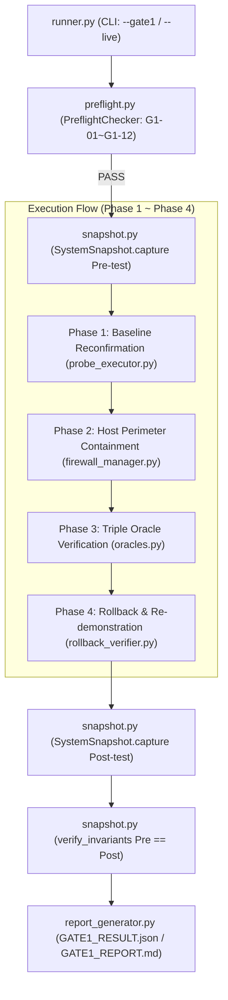

# S2-D Execution Graph & Architecture Trace

- **Date**: 2026-09-25T05:25:00+08:00
- **Scope**: `scripts/s2_v2/s2_d/`
- **Gate**: Gate 0 Architectural Review

---

## 1. Top-Level Execution Topology

---

## 2. Component Coupling & Data Flow Trace

1. **`runner.py`**:
   - Parses flags (`--gate1`, `--live`, `--output-dir`).
   - If `--live` is passed without human override authorization, execution halts immediately with `SystemExit(2)`.
   - Delegates preflight to `preflight.py`.
   - Triggers `report_generator.py` upon completion.

2. **`preflight.py`**:
   - Verifies 12 discrete checkpoints:
     - `G1-01`: S2-C baseline anchor integrity (`s2_v2_c_reconciliation.json` exists and matches anchor hash).
     - `G1-02`: Clean git status on target paths.
     - `G1-03`: PX4 process detection and PID stability.
     - `G1-04`: Firewall baseline captured.
     - `G1-05`: Snapshot serialization tested.
     - `G1-06`: Snapshot self-integrity round-trip validated.
     - `G1-07`: Probe construction validated.
     - `G1-08`: Firewall manager dry-run non-mutation verified.
     - `G1-09`: PX4 non-mutation confirmed.
     - `G1-10`: Process restart non-attempt confirmed.
     - `G1-11`: Rollback non-attempt in dry-run confirmed.
     - `G1-12`: Oracle unit tests verified.

3. **`firewall_manager.py`**:
   - Encapsulates `iptables` rule generation.
   - Enforces port whitelist `{18570, 13030, 14280}` and blacklist `{14580, 14540, 14588}`.
   - Guarantees symmetric teardown in LIFO order.

4. **`probe_executor.py`**:
   - Constructs MAVLink `PARAM_SET` mutation packets (`MIS_TAKEOFF_ALT`, `TRIG_INTERVAL`).
   - In dry-run, returns `ProbeResult(sent=False, bytes_transferred=0)`.

5. **`oracles.py`**:
   - **Oracle A**: Evaluates network containment (packet drop counters > 0).
   - **Oracle B**: Evaluates target state immutability (target param $\Delta = 0$).
   - **Oracle C**: Evaluates control path preservation (PEP port 14540 / 14580 unaffected).
   - Composite verdict derivation enforces fail-closed semantics:
     $$\text{Verdict} = (A \land B \land C) \implies \text{PASS} \quad | \quad \text{FAIL}$$

6. **`rollback_verifier.py`**:
   - Phase 4 re-verification: rolls back firewall rules, resends probe, verifies bypass behavior returns to pre-containment baseline.

7. **`snapshot.py`**:
   - Captures system state hash ($H(F_{pre}), H(PID_{pre}), H(Listeners_{pre})$).
   - Validates post-test invariance: $F_{post} \equiv F_{pre}$, $PID_{post} \equiv PID_{pre}$.
